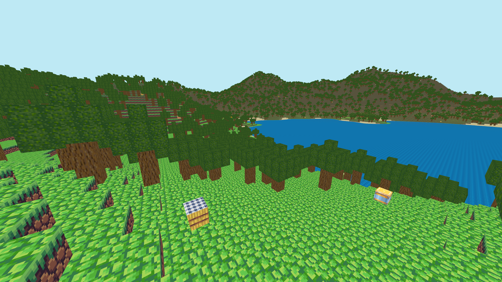
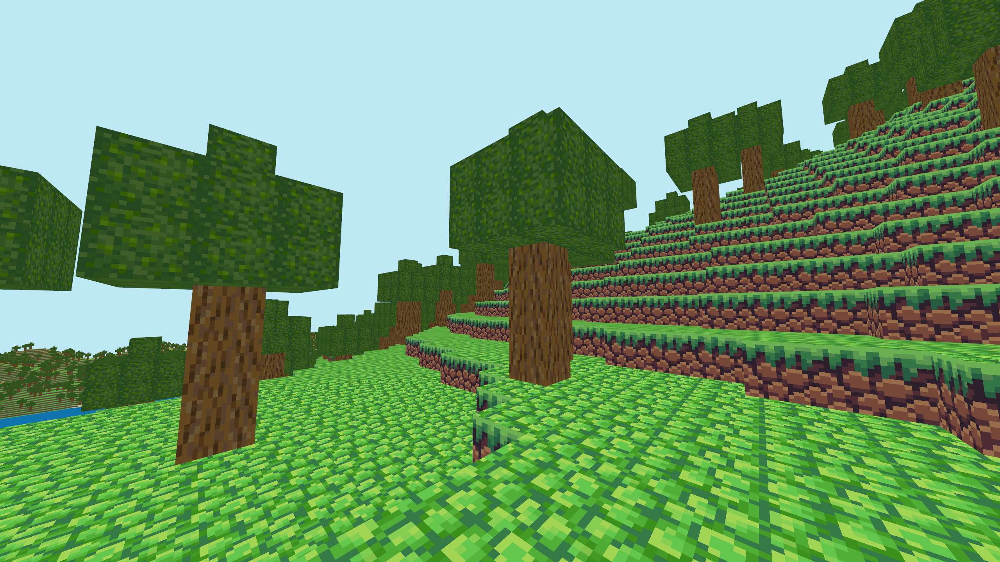
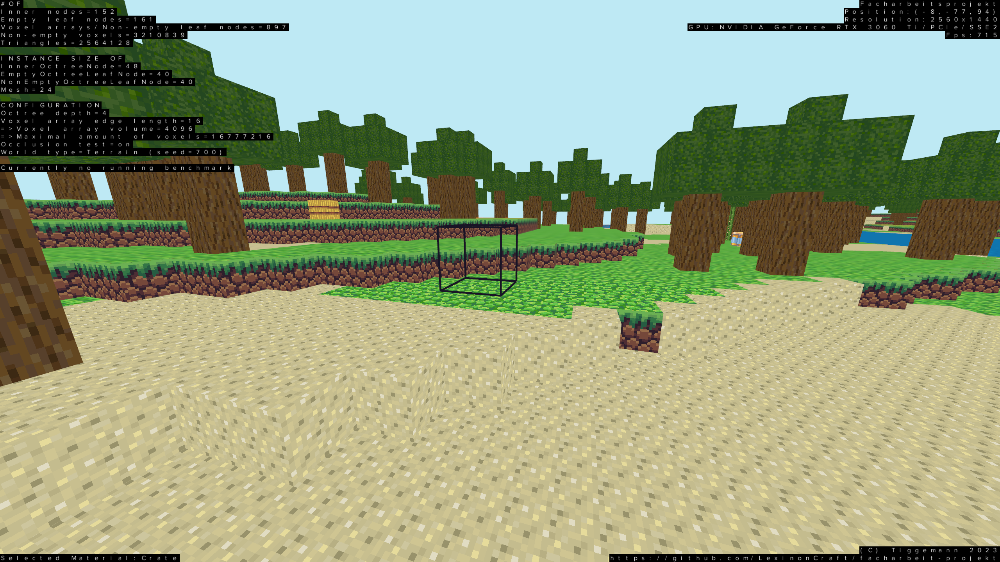

# Facharbeit Project

This project, which I created for my "Facharbeit" (a small scientific paper mandatory for German students in higher grades), is a game inspired by the popular game "Minecraft". Using voxels that can be placed and removed individually, you can build, edit and demolish various structures, all in a procedurally generated world. The game is implemented with Java and OpenGL (using LWJGL). In particular, an octree is used to reduce the required amount of memory, and faces concealed between two blocks (which are unnecessary to render) are detected using a simple algorithm (the central subject of my paper was to analyze the impact of these optimizations on performance and memory usage).

## Building and running the project

After cloning the repository, the project **should** be able to be built and run using the commands
```
./gradlew build
./gradlew run
```
(although I cannot guarantee that this will work on your machine).

## Controls and configuration

| Key(s) | Action |
| - | - |
| `W`, `A`, `S`, `D` | horizontal movement |
| `Space`, `Shift` | vertical movement |
| `Alt` + mouse wheel | adjust focal length |
| `Ctrl` + mouse wheel | adjust speed of movement |
| `F1` | show/hide voxel selection box |
| mouse wheel | adjust distance of voxel selection box to camera |
| right mouse button | place voxel |
| left mouse button | remove voxel |
| (`Ctrl` +) `1`-`9` | select voxel material |
| `F3` | show/hide debug overlay |
| `F5` | prepare/start/stop benchmark with configured duration |
| `F6` | prepare/start/stop benchmark without fixed duration |
| `F2` | save screenshot (in `./run/screenshots`) |

The following options can be changed in the file `./run/config.txt` (which you may have to create first):
| Option | Range of values | Details | Default |
| - | - | - | - |
| `occlusion-test` | `true`, `false` | Should obstructed faces be skipped during rendering? | `true` |
| `edge-length-exponent` | non-negative integers | the size of the world will be `2^{value}` (in each direction) | 4 |
| `octree-depth` | non-negative integers | the depth of the octree | 4 |
| `world-type` | `terrain`, `empty`, `flat` | `terrain`: procedurally generated landscape, `empty`: empty world, `flat`: flat world | `terrain` |
| `seed` | integers | the seed to be used to generate the landscape (with `world-type=terrain`) | 236 |
| `flat-world-height` | non-negative integers | the height of the flat world (with `world-type=flat`) | 3 |
| `place-trees` | `true`, `false` | Should trees be placed? (effectless if `world-type=empty`) | `true` |
| `place-decorations` | `true`, `false` | Should decorations be placed? (effectless if `world-type=empty`) | `true` |
| `benchmark-duration` | non-negative floats | the maximum duration of the benchmark (with `F5`) | 30 |
The configuration must be specified in **exactly** this way (with no additional spaces):
```
<option1>=<value1>
<option2>=<value2>
...
```

## Screenshots







